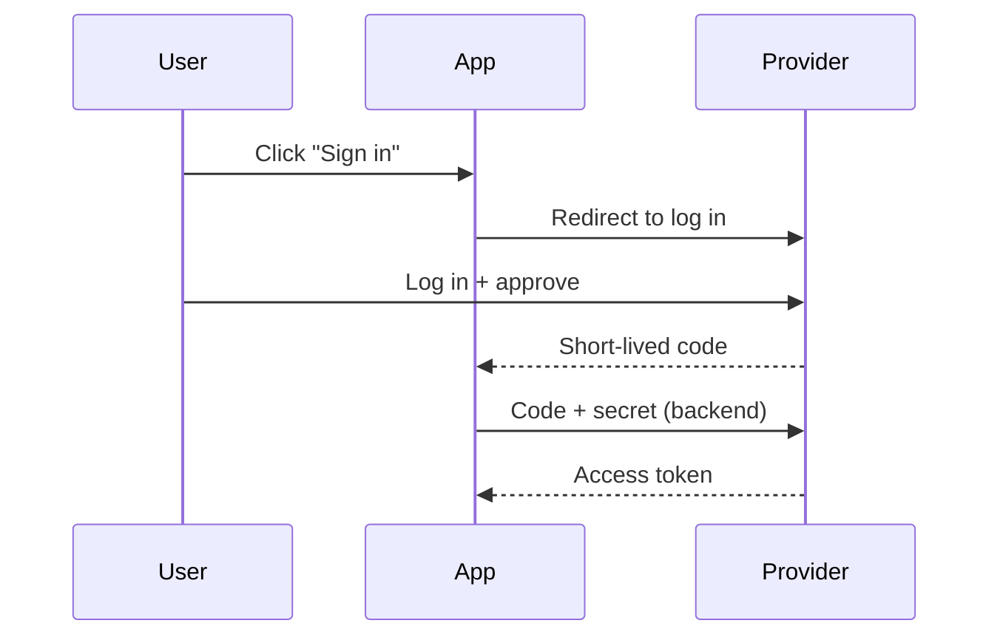

# Answering with the Golden Circle

## Overview

Answer inside-out, following Simon Sinek's Golden Circle: **Why → How → What**. Most answers lead with *What* (the facts, the recommendation) and leave the purpose implicit. This skill inverts that: start from the purpose and belief driving the answer, move to the approach, and land on the concrete specifics last.

**Core principle:** "People don't buy what you do; they buy why you do it." An answer lands harder when the reader understands the *why* before the *what* — and when it's said in **plain language**, with a **diagram** whenever a picture makes it clearer.

## The Contract — every answer has exactly these three sections, in this order

1. **## Why** — The purpose, root reason, or driving belief behind the answer. Why does this question matter? What goal or principle should steer the decision? This is the conviction, not a restatement of the question and not the recommendation itself.
2. **## How** — The approach, mechanism, or method. How the thing works, or how you'd get there. The principles, conditions, and trade-offs that turn the Why into action.
3. **## What** — The concrete, tangible answer. The specific recommendation, the direct yes/no, the steps, the bottom line. Everything the reader can act on immediately.

Each section must be genuinely distinct: **Why** = purpose, **How** = method, **What** = the deliverable. If a point is a concrete action, it belongs in *What*, not *Why*.

## Speak plainly

Write so a smart non-expert gets it on the first read.

- **Prefer everyday words.** Say "hands off access without sharing your password" before "delegated authorization." If a technical term is needed, define it in the same breath the first time it appears.
- **Short sentences, one idea each.** Break a long sentence into two.
- **Use a quick analogy** when it makes an abstract idea concrete (e.g. "an access token is like a hotel keycard — limited, time-boxed, and not your actual identity").
- **Cut filler and hedging.** Plain does not mean dumbed-down: keep the precision, drop the jargon and throat-clearing.

## Add a diagram only when it earns its place

A diagram is an aid, **never mandatory**. Add one only when a picture conveys the structure faster than words.

**A diagram usually helps for:** multi-step flows or sequences, several parties exchanging messages, hierarchies/trees, state transitions, side-by-side comparisons, or "how the pieces connect."

**Skip the diagram for:** yes/no answers, opinions/recommendations, a short list of steps, or anything a sentence already makes obvious. When in doubt, leave it out — a forced or trivial diagram adds noise.

Prefer a **Mermaid** fenced block (```mermaid) or simple ASCII. Keep it small and labelled. Put it in whichever section it clarifies — usually **How** (the mechanism) — and still explain it in words; the diagram supplements the text, it doesn't replace it.



## Example (diagram not needed — a recommendation question)

**Question:** "Should our team adopt trunk-based development?"

> ## Why
> A branching strategy exists for one reason: ship working software to users quickly and safely. Trunk-based development shrinks the time between writing code and releasing it, and keeps everyone building on the same shared code instead of drifting apart on long-lived branches. If fast, frequent, low-risk delivery is the goal, that's the thing to optimize for.
>
> ## How
> Everyone merges small changes into one main branch, several times a day, hidden behind feature flags and caught by automated tests. This only stays safe when integration is cheap and constant: solid CI, branches that live 1–3 days at most, and quick reviews. Where releases are rare, tests are weak, or the team works far apart, that safety net frays and the friction outweighs the benefit.
>
> ## What
> Adopt it **if you release at least weekly and have decent automated tests** — start with short-lived branches and add feature flags. **Hold off** if you're on a slow or regulated release cycle, or lack a test safety net; fix testing and release cadence first. Next step: check your release frequency and test coverage, then pick the matching path.

## Quick Reference

| Section | Answers | Contains |
|---------|---------|----------|
| Why | Why does this matter? | Purpose, belief, the goal to optimize for |
| How | How does it work / how to get there? | Method, principles, conditions, trade-offs (diagram often fits here) |
| What | What exactly? | Direct answer, recommendation, steps, bottom line |

## Common Mistakes

- **Leading with the recommendation in Why.** The verdict is a *What*. Why is the purpose underneath it.
- **Duplicating content across sections.** If How and What say the same thing, How wasn't about method.
- **Jargon on the first pass.** Introduce the plain idea first, name the technical term second.
- **Forcing a diagram.** No diagram for a yes/no or an opinion. Only draw when structure beats prose.
- **A diagram with no words.** Always explain the picture in text too.
- **Padding a simple question.** Keep each section as short as the question deserves. The structure is the point, not the length.
- **Skipping straight to What because "the user just wants the answer".** The point of this skill is the inside-out framing; deliver all three.
